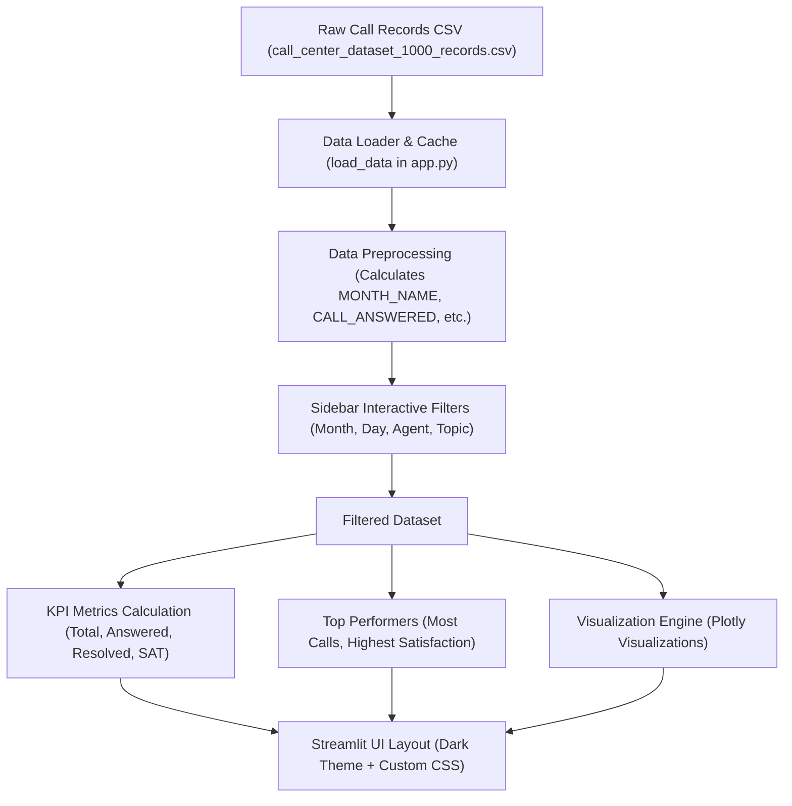

# 📞 Call Center Performance Dashboard (2025)

An interactive, high-fidelity business intelligence dashboard engineered to analyze call center efficiency, agent performance, and customer satisfaction metrics. Featuring a modern dark mode aesthetic, comprehensive filters, and premium interactive data visualizations built using Python, Streamlit, and Plotly.

---

## 🗺️ Application Architecture & Data Flow

This dashboard leverages a cached load-and-filter pipeline to deliver instantaneous interactive updates.



---

## 🚀 Key Features

* **🎛️ Multi-Dimensional Sidebar Filters**: Filter data in real-time by **Month**, **Day of the Week**, **Agent**, and **Call Topic**. All charts and metrics update instantly based on the selections.
* **📈 Premium KPI Cards**: Custom-styled cards with smooth linear gradients that showcase core metrics at first glance:
  * **Total Calls**: Total volume of calls within the active filter scope.
  * **Calls Answered**: Answered calls count, featuring a green percentage indicator relative to total calls.
  * **Calls Resolved**: Number of resolved issues, highlighting the resolution rate of answered calls.
  * **Not Resolved**: Total unresolved calls with a yellow warning indicator.
  * **Average Satisfaction Rate**: Out of 5.0 stars (⭐), tracking customer experience.
* **🏆 Interactive Agent Spotlight**: Real-time identification of top performers:
  * **🥇 Productivity Leader**: Displays the agent with the highest volume of answered calls.
  * **🌟 Quality Leader**: Displays the agent with the highest average customer satisfaction rate.
* **📊 Modern Data Visualizations**:
  * **Call Volume by Topic**: Stacked horizontal bar chart showing resolved vs. answered calls per topic.
  * **Answered vs. Resolved**: A clean donut chart showing proportional outcomes, centering the key answer rate.
  * **Call Duration by Agent**: Visualizes both average call duration (seconds) and cumulative total talk time.
  * **Call Resolution Funnel**: An elegant funnel chart demonstrating drop-off from total calls received to resolved cases.
  * **Monthly & Weekday Trends**: Combined bar/line charts illustrating seasonal monthly volume and weekday distributions.
  * **Agent × Topic Satisfaction Heatmap**: An interactive correlation matrix mapping agent performance across different inquiry types using a custom color scale (`RdYlGn`).
  * **Agent Performance Comparison**: A side-by-side subplot comparison measuring relative call handle volumes and satisfaction scores.
* **🎯 Comprehensive Performance Scorecard**: Includes a custom gauge chart showing the cumulative overall score, a radar chart comparing active performance against target thresholds (80%) across five categories, and an academic grade evaluation card (A+, A, B, C, D) based on performance benchmarks.

---

## ⚖️ Performance Evaluation Scoring Model

To evaluate overall call center health, the dashboard implements a custom weighted scoring algorithm:

$$\text{Overall Score} = (\text{Answer Rate} \times 30\%) + (\text{Resolution Rate} \times 35\%) + (\text{Satisfaction Rate \%} \times 25\%) + (\text{Response Speed Score} \times 10\%)$$

### Metric Calculations:
1. **Answer Rate**: $\frac{\text{Calls Answered}}{\text{Total Calls}} \times 100$
2. **Resolution Rate**: $\frac{\text{Calls Resolved}}{\text{Calls Answered}} \times 100$
3. **Satisfaction Rate %**: $\frac{\text{Avg. Satisfaction Rate}}{5.0} \times 100$
4. **Response Speed Score**: $\max\left(0, 100 - \frac{\text{Avg. Speed of Answer (sec)}}{3}\right)$

### Score Grading Schema:
* **Score $\ge$ 90%**: Grade **A+** (Exceptional Performance)
* **Score $\ge$ 80%**: Grade **A** (Excellent Performance)
* **Score $\ge$ 70%**: Grade **B** (Good Performance)
* **Score $\ge$ 60%**: Grade **C** (Average Performance)
* **Score $<$ 60%**: Grade **D** (Needs Improvement)

---

## 📊 Database Schema

The dashboard reads call data from `call_center_dataset_1000_records.csv`, which consists of 1,000 call records across the following columns:

| Column Name | Data Type | Description | Role in Metrics |
| :--- | :---: | :--- | :--- |
| **`CALLER ID`** | `String` | Unique call identifier (e.g., `C00001`) | Used to count total calls and track volume |
| **`AGENT`** | `String` | Name of the handling agent | Dynamic sidebar filters and agent comparison subplots |
| **`DATE`** | `Date` | Date of the call in `M/D/YYYY` format | Parsed into Month and Day of Week metrics |
| **`TIME`** | `Time` | Time of the call in `HH:MM:SS` format | Captures call timing |
| **`TOPIC`** | `String` | Subject of customer inquiry (e.g., `Technical Support`) | Used for topic volume and satisfaction heatmaps |
| **`ANSWERED`** | `Char (Y/N)`| Indication if the call was answered by an agent | Calculated to derive `Answer Rate` KPI |
| **`RESOLVED`** | `Char (Y/N)`| Indication if the customer query was resolved | Calculated to derive `Resolution Rate` KPI |
| **`SPEED OF ANSWER IN SECOND`** | `Integer` | Seconds elapsed before the call was answered | Standardized to compute `Response Speed Score` |
| **`AVG. TALK DURATION`** | `Float` | The total talk duration in seconds | Aggregated to track individual and total conversation duration |
| **`SATISFACTION RATE`** | `Float` | Customer experience score (1.0 to 5.0) | Tracks agent satisfaction averages and overall performance |

---

## 🛠️ Tech Stack & Dependencies

* **Frontend Framework**: [Streamlit](https://streamlit.io/) — Serves as the web app container, rendering the sidebar widgets, page layout, and custom CSS styles.
* **Data Processing**:
  * **Pandas** — Handles date parsing, custom column calculation, and aggregations (filtering, grouping).
  * **NumPy** — Powers numerical array transformation for rendering satisfaction rate heatmaps.
* **Visualization Engine**:
  * **Plotly Express & Graph Objects** — Generates responsive, high-fidelity, and fully customizable charts (heatmaps, gauges, subplots, bar charts, donut charts, and funnel charts) with transparent backgrounds matching the dark theme.

---

## ⚡ Installation & Execution Guide

### 1. Prerequisites
Ensure you have **Python 3.9+** installed on your system.

### 2. Set Up a Virtual Environment (Recommended)
Navigate to the project root directory and create/activate a virtual environment:

**Windows (PowerShell/CMD):**
```powershell
# Create environment
python -m venv .venv

# Activate environment
.venv\Scripts\Activate.ps1
```

**macOS / Linux:**
```bash
# Create environment
python3 -m venv .venv

# Activate environment
source .venv/bin/activate
```

### 3. Install Dependencies
Install all required libraries using the provided `requirements.txt`:
```bash
pip install -r requirements.txt
```

### 4. Launch the Dashboard
Run the Streamlit application:
```bash
streamlit run app.py
```
After executing, the dashboard will open automatically in your default browser at `http://localhost:8501`.

---

## 🎨 User Experience Highlights

* **Harmonious Dark Theme**: Sleek deep indigo and charcoal gradients (`#0f1117` to `#1e2235`) paired with soft pastel indicators (green, blue, purple, yellow) ensure optimal readability and high-end aesthetic appeal.
* **Interactive Responsive Charts**: Hovering over any Plotly visualization displays clean tooltips detailing exact values, percentages, and metrics.
* **Smart Data Caching**: Uses Streamlit's `@st.cache_data` caching to load the CSV dataset once, guaranteeing lightning-fast filtering response times.
